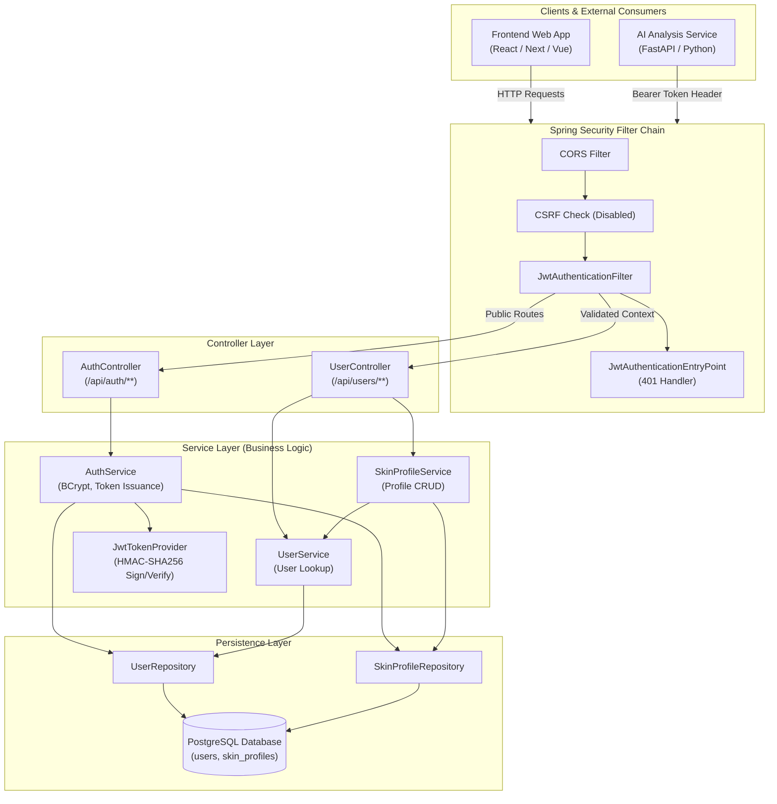
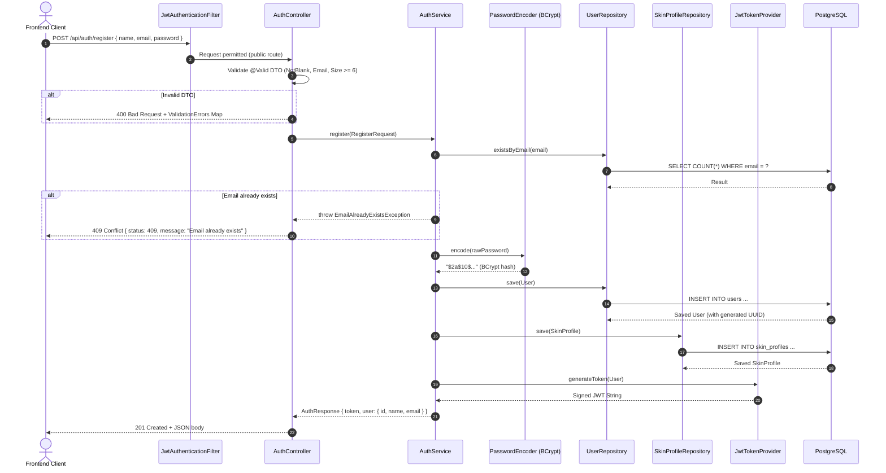
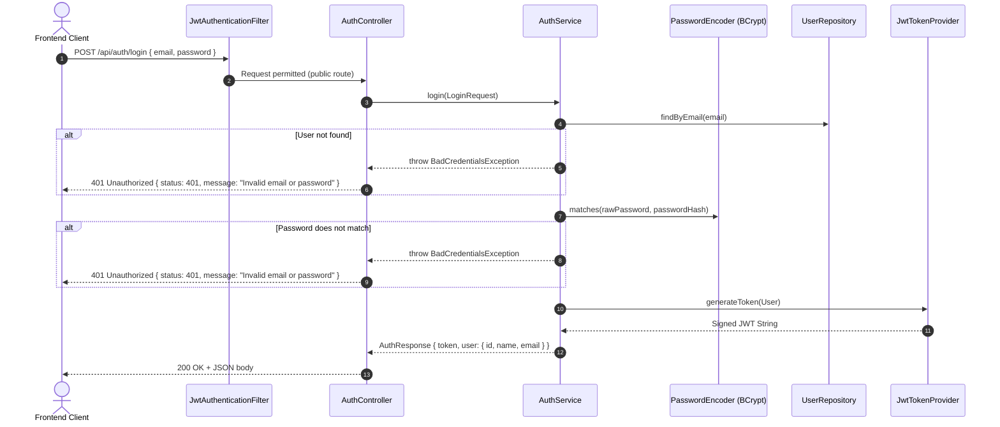
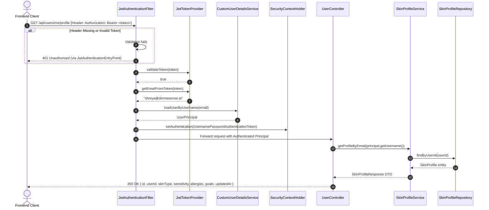
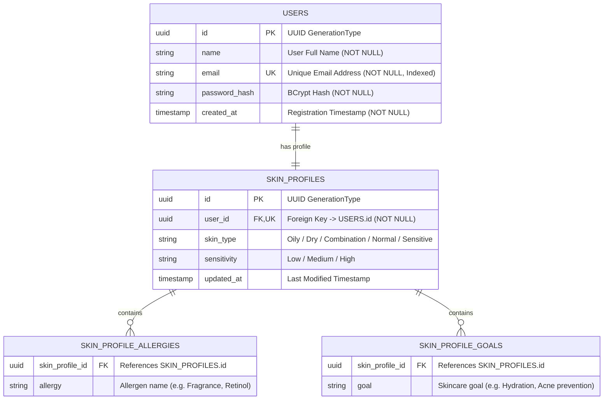

# DermaSense AI — Authentication & User/Skin Profile Service
**Developer:** Shreya  
**Service Role:** Foundational User Authentication, JWT Security & Skin Profile Management  
**Tech Stack:** Spring Boot 3.3.4, Spring Security 6, Spring Data JPA / Hibernate, JJWT 0.12.6, PostgreSQL / H2, Maven  
**Branch:** `feature/auth-service`

---

## Table of Contents
1. [Executive Summary & Service Overview](#1-executive-summary--service-overview)
2. [What Has Been Completed](#2-what-has-been-completed)
3. [Architecture & System Design](#3-architecture--system-design)
4. [Detailed Flow Logic & Sequence Diagrams](#4-detailed-flow-logic--sequence-diagrams)
5. [Database Schema & Entity Models](#5-database-schema--entity-models)
6. [API Contract & Endpoint Reference](#6-api-contract--endpoint-reference)
7. [Security & Token Verification Blueprint](#7-security--token-verification-blueprint)
8. [Work Remaining / Team Integration Checklist](#8-work-remaining--team-integration-checklist)

---

## 1. Executive Summary & Service Overview

DermaSense AI is an AI-powered skin health tracking platform. The **Authentication & User/Skin Profile service** is the foundational subsystem upon which all other project services depend (such as AI skin photo analysis, habit tracker, and routine recommendation engines).

### Key Responsibilities:
- **Identity & Access Management (IAM):** User registration, password encryption (BCrypt), credential verification, and stateless JWT issuance.
- **Request Authorization:** Intercepting incoming HTTP requests via a servlet filter, extracting Bearer tokens, and authenticating user context.
- **Skin Profile Management:** Persistent storage and CRUD endpoints for user skin properties (skin type, sensitivity level, allergies, skincare goals).
- **Inter-service Foundation:** Providing signed JWT tokens containing `userId` and `email` for downstream services (`ai-service`, recommendations) to verify identity.

---

## 2. What Has Been Completed

### A. Core Architecture & Layered Structure
All components follow a clean, maintainable layered design pattern under `com.dermasense.auth`:
```
backend/src/main/java/com/dermasense/auth/
├── DermaSenseAuthApplication.java   # Spring Boot entrypoint
├── config/                          # SecurityConfig, CORS
├── controller/                      # AuthController, UserController
├── dto/                             # Request/Response payloads
├── entity/                          # User, SkinProfile (JPA)
├── exception/                       # GlobalExceptionHandler, Custom exceptions
├── repository/                      # UserRepository, SkinProfileRepository
├── security/                        # JwtTokenProvider, JwtAuthFilter, UserPrincipal
└── service/                         # AuthService, UserService, SkinProfileService
```

### B. Database Entities & JPA Mapping
- **`User` Entity (`users` table):**
  - Primary key: `id` (UUID generated)
  - Fields: `name`, `email` (unique index), `passwordHash` (BCrypt), `createdAt` (audit timestamp)
  - Relationship: `@OneToOne` bidirectional link with `SkinProfile` (cascade all, orphan removal)
- **`SkinProfile` Entity (`skin_profiles` table):**
  - Primary key: `id` (UUID generated)
  - Foreign key: `user_id` (unique, linked to `users.id`)
  - Fields: `skinType` (e.g. Oily, Dry), `sensitivity` (e.g. Low, High), `updatedAt`
  - Collections: `allergies` (`skin_profile_allergies` table) and `goals` (`skin_profile_goals` table) via `@ElementCollection`

### C. Security & JWT Filter Engine
- **`JwtTokenProvider`:** Generates HMAC-SHA256 tokens with configurable expiration (`JWT_EXPIRATION_MS`) and secret key (`JWT_SECRET`). Embeds subject (`email`), `userId`, and `name` in claims.
- **`JwtAuthenticationFilter`:** `OncePerRequestFilter` that inspects `Authorization: Bearer <token>`, validates signature/expiry, loads user details, and populates `SecurityContextHolder`.
- **`SecurityConfig`:**
  - Stateless session policy (`SessionCreationPolicy.STATELESS`)
  - CSRF disabled for REST API
  - Public endpoints: `POST /api/auth/register`, `POST /api/auth/login`, `/error`
  - Protected endpoints: `GET /api/users/me`, `GET /api/users/me/profile`, `PUT /api/users/me/profile`, and all other `/api/**`
  - Custom `JwtAuthenticationEntryPoint` returning structured JSON on 401 Unauthorized.

### D. REST API Endpoints Implemented
1. `POST /api/auth/register` — Creates user, hashes password, initializes empty profile, issues JWT. (Status: `201 Created`)
2. `POST /api/auth/login` — Verifies email/password via BCrypt, issues JWT. (Status: `200 OK`)
3. `GET /api/users/me` — Returns current authenticated user details from token. (Status: `200 OK`)
4. `GET /api/users/me/profile` — Retrieves user's skin profile. (Status: `200 OK`)
5. `PUT /api/users/me/profile` — Updates user's skin type, sensitivity, allergies, and goals. (Status: `200 OK`)

### E. Error Handling & Validation
- **`GlobalExceptionHandler` (`@RestControllerAdvice`):**
  - `400 Bad Request` — Field validation errors (`MethodArgumentNotValidException`)
  - `401 Unauthorized` — Bad credentials or invalid/expired JWT (`BadCredentialsException`, `AuthenticationException`)
  - `404 Not Found` — Resource missing (`ResourceNotFoundException`)
  - `409 Conflict` — Email already registered (`EmailAlreadyExistsException`)
  - `500 Internal Server Error` — Catch-all unexpected runtime errors

### F. Automated Verification & Testing (17/17 Tests Passing)
- **Unit Tests:**
  - `AuthServiceTest`: Happy path registration, duplicate email rejection (409), successful login, bad password rejection (401), missing user rejection (401).
  - `SkinProfileServiceTest`: Profile fetching and field updating.
- **Integration Tests (`@SpringBootTest` + `MockMvc`):**
  - `AuthControllerIntegrationTest`: Full HTTP round-trip tests for registration and login.
  - `UserControllerIntegrationTest`: Endpoint protection, bearer token validation, profile retrieval, and profile modification.

---

## 3. Architecture & System Design

### High-Level Service Architecture



---

## 4. Detailed Flow Logic & Sequence Diagrams

### 1. User Registration Flow (`POST /api/auth/register`)



---

### 2. User Login Flow (`POST /api/auth/login`)



---

### 3. Protected Endpoint Execution Flow (`GET /api/users/me/profile`)



---

## 5. Database Schema & Entity Models



---

## 6. API Contract & Endpoint Reference

### Base URL: `http://localhost:8080` (Configurable via `PORT`)

| Method | Endpoint | Access | Description |
|---|---|---|---|
| `POST` | `/api/auth/register` | Public | Register new user account & initialize skin profile |
| `POST` | `/api/auth/login` | Public | Authenticate user credentials & receive JWT token |
| `GET` | `/api/users/me` | Bearer Auth | Retrieve authenticated user's account details |
| `GET` | `/api/users/me/profile` | Bearer Auth | Retrieve authenticated user's skin profile |
| `PUT` | `/api/users/me/profile` | Bearer Auth | Update authenticated user's skin profile |

---

### Request / Response Examples

#### 1. Register
- **Request:** `POST /api/auth/register`
```json
{
  "name": "Shreya Sharma",
  "email": "shreya@dermasense.ai",
  "password": "securePassword123"
}
```
- **Response (201 Created):**
```json
{
  "token": "eyJhbGciOiJIUzI1NiJ9...",
  "user": {
    "id": "c3f848bb-7d8b-4f91-88f2-8924376c2a55",
    "name": "Shreya Sharma",
    "email": "shreya@dermasense.ai"
  }
}
```

#### 2. Login
- **Request:** `POST /api/auth/login`
```json
{
  "email": "shreya@dermasense.ai",
  "password": "securePassword123"
}
```
- **Response (200 OK):**
```json
{
  "token": "eyJhbGciOiJIUzI1NiJ9...",
  "user": {
    "id": "c3f848bb-7d8b-4f91-88f2-8924376c2a55",
    "name": "Shreya Sharma",
    "email": "shreya@dermasense.ai"
  }
}
```

#### 3. Get Current User (`GET /api/users/me`)
- **Headers:** `Authorization: Bearer <TOKEN>`
- **Response (200 OK):**
```json
{
  "id": "c3f848bb-7d8b-4f91-88f2-8924376c2a55",
  "name": "Shreya Sharma",
  "email": "shreya@dermasense.ai",
  "createdAt": "2026-08-25T01:30:00Z"
}
```

#### 4. Get / Update Skin Profile
- **Request:** `PUT /api/users/me/profile`
- **Headers:** `Authorization: Bearer <TOKEN>`
```json
{
  "skinType": "Combination",
  "sensitivity": "Medium",
  "allergies": [
    "Fragrance",
    "Parabens"
  ],
  "goals": [
    "Hydration",
    "Acne prevention",
    "Anti-aging"
  ]
}
```
- **Response (200 OK):**
```json
{
  "id": "97e68270-e55d-4a11-b461-12c8ff45791c",
  "userId": "c3f848bb-7d8b-4f91-88f2-8924376c2a55",
  "skinType": "Combination",
  "sensitivity": "Medium",
  "allergies": [
    "Fragrance",
    "Parabens"
  ],
  "goals": [
    "Hydration",
    "Acne prevention",
    "Anti-aging"
  ],
  "updatedAt": "2026-08-25T01:35:12Z"
}
```

#### 5. Standard Error Structure (400, 401, 404, 409)
```json
{
  "timestamp": "2026-08-25T01:36:00Z",
  "status": 409,
  "error": "Conflict",
  "message": "An account with email shreya@dermasense.ai already exists",
  "path": "/api/auth/register"
}
```

---

## 7. Security & Token Verification Blueprint

### JWT Token Anatomy
The JWT emitted by this service uses HMAC-SHA256 (`HS256`).
- **Header:** `{"alg": "HS256", "typ": "JWT"}`
- **Claims (Payload):**
  ```json
  {
    "sub": "shreya@dermasense.ai",
    "userId": "c3f848bb-7d8b-4f91-88f2-8924376c2a55",
    "name": "Shreya Sharma",
    "email": "shreya@dermasense.ai",
    "iat": 1787620000,
    "exp": 1787706400
  }
  ```

### For Team Members / Other Microservices:
- **`ai-service` (Python / FastAPI):** To authenticate requests from the frontend, verify the Bearer token using the shared `JWT_SECRET` via PyJWT:
  ```python
  import jwt
  payload = jwt.decode(token, JWT_SECRET, algorithms=["HS256"])
  user_id = payload.get("userId")
  ```
- **Frontend App:** Store `token` in memory / secure storage and attach to every subsequent request in the `Authorization` header:
  `Authorization: Bearer <token>`

---

## 8. Work Remaining / Team Integration Checklist

| Task | Assignee / Collaborator | Status | Action Item |
|---|---|---|---|
| **Auth & Profile Service Implementation** | Shreya | **COMPLETED** | Tested, verified, 17/17 tests passing, committed. |
| **Push Branch to Origin** | Shreya | **COMPLETED** | `git push -u origin feature/auth-service` pushed. |
| **Pull Request & Code Review** | Tarun (Team Lead) | **PENDING** | Tarun reviews PR & merges `feature/auth-service` into `main`. |
| **Sync `main` after PR merge** | Shreya | **UPCOMING** | `git checkout main && git pull` |
| **AI Service Token Integration** | AI Team Member + Shreya | **UPCOMING** | Share `JWT_SECRET` and claims contract (`userId`) with `ai-service`. |
| **Frontend Auth Context & Storage** | Frontend Developer + Shreya | **UPCOMING** | Connect React/Vite login and registration forms to `/api/auth/*`. |
| **Skin Profile Onboarding Flow** | Frontend Developer + Shreya | **UPCOMING** | Call `PUT /api/users/me/profile` during user onboarding quiz. |
