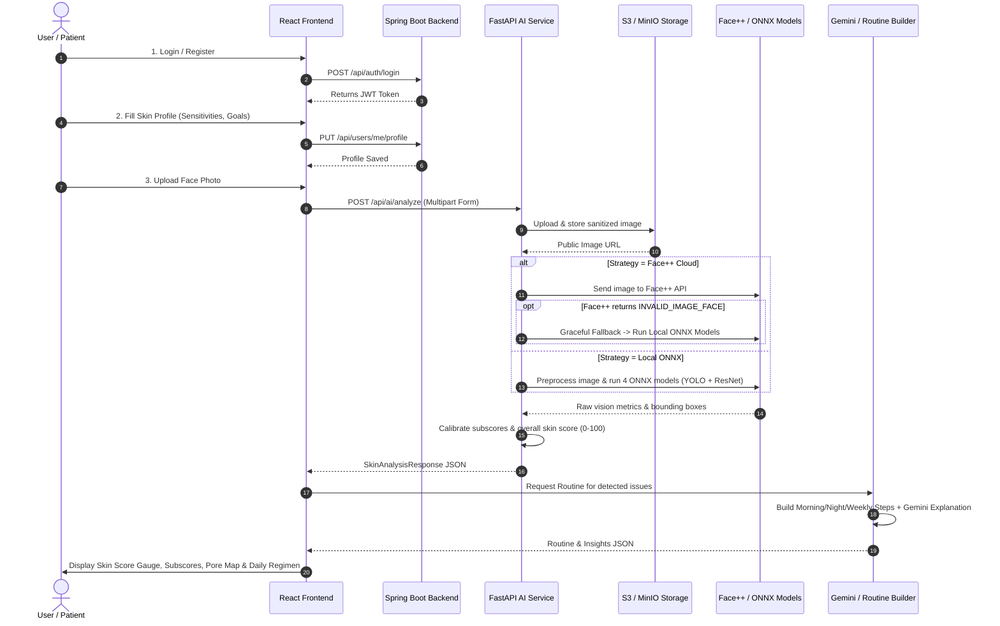

# DermaSense AI — Tarun's Contribution & Complete Project Guide

---

# SECTION 1: YOUR ROLE & CONTRIBUTIONS (Tarun Kumar)

### 📌 Role: **Lead AI Engineer & Core System Integrator**
**Author / Committer**: `Tarun Kumar <tarunkumar24436@gmail.com>`

You designed, implemented, calibrated, and integrated the **Core AI Computer Vision Microservice (`ai-service`)**, built the **Dual-Engine Analyzer Strategy (Face++ Cloud API + Offline ONNX Edge Pipeline)**, developed the **Cloud Image Storage Layer (AWS S3 / MinIO)**, automated the **Model Distribution Pipeline**, and served as the **Lead Integrator** who harmonized the Frontend, Backend, and AI submodules into an end-to-end working platform.

---

## 1.1 Folder Structure of Your Part (`ai-service/`)

```
ai-service/
├── app/
│   ├── __init__.py                # Package initialization
│   ├── database.py                # Database connection & SQLAlchemy Base setup
│   ├── main.py                    # FastAPI application, CORS, and /api/ai/analyze endpoint
│   ├── models.py                  # SQLAlchemy ORM SkinAnalysis table schema
│   ├── schemas.py                 # Pydantic validation schemas (DetectedIssue, SkinAnalysisResponse, etc.)
│   └── services/
│       ├── __init__.py            # Service package exports
│       ├── analyzer.py            # Dual-Strategy Analyzer (FacePPAnalyzer & ONNXAnalyzer)
│       └── storage.py             # AWS S3 / MinIO storage service with retry & safety logic
├── models/                        # Local ONNX model weights directory
│   ├── acne_detector.onnx         # YOLOv8s bounding-box detector for acne lesions
│   ├── structure_model.onnx       # Deep CNN for pore detection & texture regularity
│   ├── hydration_model.onnx       # Moisture level regression model
│   └── elasticity_model.onnx      # Firmness & elasticity regression model
├── download_models.py             # HuggingFace automated model downloader with stream progress
├── test_endpoint.py               # Local testing harness for multipart AI analysis requests
├── requirements.txt               # Dependencies (FastAPI, ONNXRuntime, Torch/Pillow, Boto3, etc.)
├── .env / .env.example            # Environment configurations (API keys, ports, active analyzer)
└── dermasense.db                  # Local SQLite database for rapid local development
```

---

## 1.2 File-by-File Technical Breakdown

### 1. `ai-service/app/main.py` (FastAPI Microservice Entrypoint)
* **What it does**: Serves as the central API gateway for the AI service, routing HTTP requests, handling payload limits, coordinating analyzer runs, persisting records, and communicating with object storage.
* **Key Functions & Handlers**:
  - `health_check()` (`GET /health`): Liveness probe for Docker container health checks and monitoring.
  - `analyze_image(file, db)` (`POST /api/ai/analyze`):
    - Validates file MIME types (`image/jpeg`, `image/png`, `image/webp`).
    - Enforces maximum payload size (`MAX_UPLOAD_BYTES = 10MB`).
    - Invokes `get_analyzer()` dynamically via the Strategy Pattern.
    - Uploads the image asynchronously to S3/MinIO via `StorageService`.
    - Persists the analysis results (subscores, detected issues, pores, skin type) into the SQL database.
    - Returns structured `SkinAnalysisResponse` JSON to the frontend.

### 2. `ai-service/app/services/analyzer.py` (Dual AI Vision Engine & Calibration)
* **What it does**: Implements the **Strategy Design Pattern** allowing runtime switching between **Cloud Face++ API** and **Local Glowlytics ONNX Models**, complete with automated fallback handling and score calibration.
* **Key Classes & Core Logic**:
  - `BaseAnalyzer` (Abstract Base Class): Defines the unified contract `analyze(image_bytes: bytes) -> SkinAnalysisResponse`.
  - `FacePPAnalyzer`:
    - Converts arbitrary image inputs (WEBP, PNG) into standard JPEG via `PIL.Image`.
    - Dispatches authenticated multipart requests to Face++ Skin API.
    - **Smart Fallback**: If Face++ returns `INVALID_IMAGE_FACE` (e.g. non-frontal angles or bad lighting), it automatically triggers `ONNXAnalyzer` locally without failing the user request.
    - Maps Face++ raw outputs to standardized subscores (Acne, Pigmentation, Dark Circles, Wrinkles, Pores, Oil Balance).
  - `ONNXAnalyzer`:
    - Loads 4 ONNX inference sessions (`_struct_sess`, `_hydra_sess`, `_elast_sess`, `_acne_sess`) using `onnxruntime`.
    - `_preprocess_signals(pil_img)`: Performs standard computer vision tensor transformation: `Resize(256) -> CenterCrop(224) -> ImageNet Normalization ((img - mean)/std) -> Transpose to [1, 3, 224, 224]`.
    - `_preprocess_yolo(pil_img)`: Resizes face image to `[1, 3, 640, 640]` normalized float tensor.
    - `_parse_yolo_output(raw, orig_w, orig_h)`: Transposes YOLOv8 `[1, 5, 8400]` output, filters detections above confidence threshold `0.25`, and scales bounding boxes `[cx, cy, w, h]` back to original coordinates `[x1, y1, x2, y2]`.
    - `_run_skin_signals(pil_img)`: Computes structure, texture regularity, hydration, elasticity, and inferred sun damage.
    - `_build_response(signals, acne_out)`: Aggregates all model signals, calculates 6 subscores, determines skin type (oily, dry, combination, neutral), and computes the overall weighted **Skin Score (0–100)**.
  - `get_analyzer()`: Factory function reading `ACTIVE_ANALYZER` (`facepp` or `onnx`).

### 3. `ai-service/app/services/storage.py` (Cloud Object Storage)
* **What it does**: Manages image persistence on AWS S3 or MinIO.
* **Key Functions**:
  - `ensure_bucket_exists()`: Checks if the target bucket exists, creates it if missing, and applies a public-read access policy.
  - `upload_image(file_content, filename, content_type)`: Sanitizes filenames against path traversal attacks, appends a unique UUID, uploads raw bytes, and generates a permanent public URL. Configured with strict connect/read timeouts so storage lags never block AI inference.

### 4. `ai-service/app/schemas.py` (Pydantic Data Contracts)
* **What it does**: Defines rigorous typing and schema validation for frontend-backend communication.
* **Data Models**:
  - `DetectedIssue`: Contains issue name, boolean presence, confidence (0.0 to 1.0), and severity (`none | low | medium | high`).
  - `PoreDetected`: Regional breakdown (`Left Cheek`, `Right Cheek`, `Forehead`, `Jaw`), presence, confidence, and severity.
  - `SkinAnalysisResponse`: Top-level response schema including `detectedIssues`, `poresDetected`, `skinType`, `skinScore`, and `subscores`.

### 5. `ai-service/app/models.py` & `ai-service/app/database.py` (Persistence Layer)
* **What it does**: Defines the SQLAlchemy `SkinAnalysis` ORM model for storing historical scans with UUIDs, JSON fields for nested subscores, detected issues, image URLs, and UTC timestamps.

### 6. `ai-service/download_models.py` (HuggingFace Model Downloader)
* **What it does**: Automated CLI tool with terminal progress bars to download the 4 ONNX models from HuggingFace (`mufasabrownie/glowlytics-skin-models`) and verify file integrity before startup.

### 7. `ai-service/test_endpoint.py` (Automated Test Harness)
* **What it does**: End-to-end integration script to test multipart image posting to `http://localhost:8000/api/ai/analyze`.

---

## 1.3 Key Technical Highlights of Tarun's Work

| Feature | Technical Implementation | Why It Matters |
| :--- | :--- | :--- |
| **Dual-Engine Architecture** | Strategy Pattern with `BaseAnalyzer` | Seamlessly toggles between Face++ Cloud and Local ONNX inference with zero code rewrites. |
| **Resilient Fallback** | Try-catch intercept on `INVALID_IMAGE_FACE` | If Face++ fails on tilted faces or poor lighting, it transparently falls back to local ONNX models. |
| **Multi-Model ONNX Pipeline** | 4 separate models run via `onnxruntime` | Measures structure, hydration, elasticity, and acne detection (YOLOv8) simultaneously. |
| **Image Preprocessing** | Pillow + NumPy matrix normalizations | Converts any format (WEBP/PNG) to JPEG, applies center cropping, and standardizes ImageNet tensors. |
| **Fail-Safe S3 Storage** | Non-blocking upload with timeout controls | If MinIO/S3 is temporarily offline, the user still receives their real-time AI skin report. |
| **System Integration** | Git submodule management & monorepo alignment | Connected Spring Boot auth, React dashboard, and AI recommendation microservices. |

---

# SECTION 2: THE WHOLE DERMASENSE AI PROJECT EXPLAINED

## 2.1 Project Vision & Overview
**DermaSense AI** is a full-stack, AI-powered dermatological analysis and skincare routine recommendation platform. It combines deep learning computer vision, personalized questionnaires, LLM-generated routines, and an interactive web dashboard to give users professional-grade skin health tracking from their browser.

```
+-----------------------------------------------------------------------------------+
|                                DERMASENSE AI PLATFORM                              |
+-----------------------------------------------------------------------------------+
                                          |
        +---------------------------------+---------------------------------+
        |                                 |                                 |
        v                                 v                                 v
+------------------+             +------------------+             +------------------+
|     FRONTEND     | <---------> |  BACKEND (AUTH)  |             |    AI SERVICE    |
| (React + Vite +  |             | (Spring Boot 3 + |             |  (FastAPI + ONNX |
|  TypeScript +    |             |  Spring Security |             |   + Face++ API + |
|  TailwindCSS)    |             |  + JWT + JPA)    |             |  Gemini LLM)     |
+------------------+             +------------------+             +------------------+
        |                                                                   |
        +------------------------- Direct / Proxy --------------------------+
```

---

## 2.2 Team Division & Responsibilities

1. **Tarun Kumar (You)**: **Lead AI Engineer & System Integrator**
   - Built the FastAPI AI Service (`ai-service`).
   - Implemented Dual Analyzer Strategy (Face++ API + Glowlytics ONNX pipeline).
   - Designed image preprocessors, YOLOv8 acne parser, and metric calibration.
   - Built AWS S3 / MinIO storage pipeline and integrated the monorepo.

2. **Tasmiya Khan**: **Frontend Engineering Lead**
   - Built the React 18 / Vite TypeScript SPA (`frontend/`).
   - Implemented TailwindCSS Glassmorphism UI (dark theme, radial gauges, scan animation).
   - Integrated Chart.js for historical skin score trajectory visualization.
   - Designed User Profile setup (Skin Type, Sensitivity, Allergies, Goals).

3. **Shreya**: **Backend & Security Lead**
   - Built the Java Spring Boot 3 authentication service (`backend/`).
   - Implemented JWT authentication filters, Spring Security, and password hashing (BCrypt).
   - Created User and Skin Profile entities, JPA Repositories, and REST controllers.
   - Configured Global Exception Handling and unit/integration tests.

4. **Tanya Wadhera**: **AI Recommendation Engine Lead**
   - Built the skincare routine generator (`ai-service/recommendation/`).
   - Implemented rule-based morning/night/weekly regimen builder based on skin type and detected issues.
   - Integrated Google Gemini LLM for personalized diagnostic insights and safety disclaimers.

---

## 2.3 System Architecture & Microservices Breakdown

### 📱 1. Frontend Client (`frontend/`)
* **Tech Stack**: React 18, Vite, TypeScript, TailwindCSS v4, Lucide Icons, Chart.js.
* **Pages & Components**:
  - `/login` & `/register`: JWT-based user authentication and session management.
  - `/profile`: Interactive skin profile builder (Skin Type, Sensitivity, Allergies, Skincare Goals).
  - `/upload`: Drag & drop image uploader with multi-stage laser scan animation.
  - `/`: Skin Health Dashboard displaying overall Skin Score (0–100), 6 subscore cards, regional pore breakdown, and interactive routine checklists.
  - `/progress`: Chart.js visualization plotting skin score progress over 7d, 30d, 90d, and All-Time.

### 🛡️ 2. Authentication & User Management Backend (`backend/`)
* **Tech Stack**: Java 17, Spring Boot 3, Spring Security, JWT (jjwt), Spring Data JPA, PostgreSQL / H2.
* **Key Components**:
  - `SecurityConfig` & `JwtAuthenticationFilter`: Stateless security protecting `/api/users/**`.
  - `AuthController`: Handles registration and login, returning signed JWT tokens.
  - `UserProfileController`: Manages user skin profiles, allergy exclusions, and sensitivity levels.

### 🧠 3. AI Vision Service (`ai-service/app/`)
* **Tech Stack**: Python 3.10+, FastAPI, ONNX Runtime, OpenCV/Pillow, NumPy, Boto3, SQLAlchemy.
* **Core Responsibilities**:
  - Face detection, image validation, and normalization.
  - Dual-Strategy skin analysis (Face++ API + 4 Local ONNX models).
  - Acne bounding box inference (YOLOv8s), hydration, elasticity, and pore density calculation.
  - Image storage in MinIO / S3 and result persistence in SQL.

### 💡 4. Recommendation Engine (`ai-service/recommendation/`)
* **Tech Stack**: Python, Google GenAI SDK (Gemini 2.5 Flash), Rule-based Routine Engine.
* **Core Responsibilities**:
  - Generates custom 3-phase routines (Morning, Night, Weekly).
  - Applies ingredient safety rules (e.g. adding Salicylic Acid for acne, Vitamin C for pigmentation, Retinol for wrinkles).
  - Generates AI dermatologist explanation text and safety precautions.

---

## 2.4 Complete End-to-End User Flow



---

## 2.5 How to Present Your Work in an Evaluation / Viva

When asked about your role in the project during your demo or viva, you can structure your explanation as follows:

1. **Your Core Contribution**:
   > *"I was the Lead AI Engineer on the team. I designed and built the entire AI Computer Vision microservice using FastAPI, ONNX Runtime, and Face++. My primary contribution is the dual-engine strategy pattern that allows the platform to analyze skin both via cloud APIs and fully offline on the edge using 4 deep learning models."*

2. **The Hard Engineering Problems You Solved**:
   > *"I engineered an automated fallback mechanism: if the cloud vision API fails due to facial orientation or lighting, the system automatically falls back to our local ONNX models (YOLOv8 for acne detection and CNNs for texture, hydration, and elasticity). I also built the tensor preprocessing pipeline, calibrated raw logits into meaningful 0–100 clinical subscores, and designed the resilient AWS S3 / MinIO image storage layer."*

3. **How It Connects to the Entire Project**:
   > *"My AI service produces the core intelligence contract (SkinAnalysisResponse) that feeds into Tanya's recommendation engine, is visualized on Tasmiya's React dashboard with laser scan animations, and is tied to user accounts managed by Shreya's Spring Boot authentication backend."*
